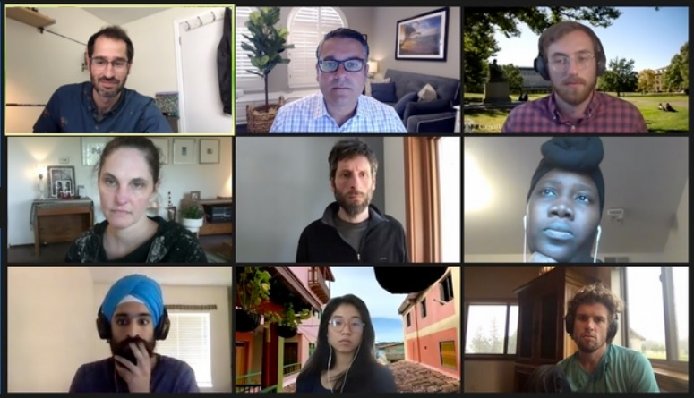

### About

<!---->

#### Fellows

  

    < img src = "{{ site.url }}{{ site.baseurl }}/assets/img/photos/Burke-Juandalyn-Headshot-scaled.jpg" width = "125">
  

  

    <h4>Juandalyn Burke</h4>
    
Juandalyn Burke is a doctoral student in the Biomedical Informatics and Medical Education department at the University of Washington. Her interests include using informatics methods and technologies to better understand and build predictive models that identify strategies for solving societal and economic issues surrounding health, education, the environment, and human rights. Prior to joining her Ph.D. program, Juandalyn worked as a data analyst/data manager, earned her Master of Public Health (MPH) in Environmental Epidemiology at the University of Michigan and a B.S. in Environmental Science from Spelman College. Her current dissertation uses mathematical modelling to predict HIV Drug Resistance in individuals and in the population for people of African descent and specifically in the areas of sub-Saharan Africa. When she is not working, you can find her checking out local artists, plays and musicians for the latest scenes and sounds!

  

  

    < img src = "{{ site.url }}{{ site.baseurl }}/assets/img/photos/Decter-Frain-Ari-Headshot-scaled.jpg" width = "125">
  

  

    <h4>Ari Decter-Frain</h4>
    
Ari Decter-Frain is a first-year doctoral student in Cornell University’s Department of Policy Analysis and Management. He holds an MSc in Inequalities and Social Science from the London School of Economics and Political Science and a B.A. in Psychology from the University of Winnipeg. Before joining Cornell, Ari worked for two years in data science and product management at MHS, a Toronto-based human capital analytics company.
Ari is interested in social policies targeting unemployed and precarious workers. He also works on quantifying political polarization in online marketplaces, and on using digital trace data for demographic estimation. His projects employ social network analysis, Bayesian statistics, and machine learning methods.

  

  

    < img src = "{{ site.url }}{{ site.baseurl }}/assets/img/photos/Murayama-Hikari-Headshot.jpg" width = "125">
  

  

    <h4>Hikari Murayama</h4>
    
Hikari Murayama is a master’s student in the Energy and Resources Group at the University of California – Berkeley. She earned her B.A. in Chemical Physics from Wellesley College while simultaneously co-founding a women’s empowerment program in Japan for high school girls called Leadership and Action for Determined Youth (LADY). Hikari then began her professional career doing economic consulting for Bates White in Washington D.C. While her interest in data and analytics never subsided, Hikari’s passion for socially-focused, impact-driven work led her to join NASA DEVELOP. She worked on land cover and water remote sensing to inform jaguar and coral reef habitat restoration efforts in Costa Rica. For her graduate work, Hikari is interested in utilizing data science and geospatial techniques to understand human-climate interactions. Hikari also likes boxing, hiking, baking, and hanging out with her dog Momo in her free time.

  

  

    < img src = "{{ site.url }}{{ site.baseurl }}/assets/img/photos/Sachdeva-Pratik-Headshot.jpg" width = "125">
  

  

    <h4>Pratik Sachdeva</h4>
     
Pratik Sachdeva (he/his/him) is a PhD student in the Physics department at the University of California, Berkeley. Prior to Berkeley, he earned his undergraduate degree at Washington University in St. Louis in Physics and Computer Science. His research lies in the realm of theoretical/computational neuroscience, which aims to use mathematical and computational tools to better understand how neural systems operate and process information. His projects include using information theoretic techniques to study how neural variability impacts information processing in neural circuits and investigating the statistical issues that impede the interpretation of parametric models of neural activity.

     
Beyond research, Pratik is committed to advancing racial and gender equity through community building and improving local governance. These interests, along with his technical background, led to his desire to participate in DSSG. He has previously worked with Respect is Part of Research (a peer-led sexual harassment/violence prevention workshop), OpenOakland, DataKind, and Delta Analytics.

  

#### Project Leads

  

    < img src = "{{ site.url }}{{ site.baseurl }}/assets/img/photos/Matt-Barreto-headshot.jpg" width = "125">
  

  

    <h4>Matt A. Barreto</h4>
     
Matt A. Barreto is Professor of Political Science and Chicana/o Studies at UCLA and the co-founder of the research and polling firm Latino Decisions. Time Magazine called Latino Decisions the “gold-standard in Latino American polling” and The Guardian wrote that Latino Decisions is “the leading Latino political opinion research group” in the United States. Barreto’s research was recognized in the 30 Latinos key to the 2012 election by Politic365, listed in the Top 100 Global Thinkers of 2012 by the European Politics Magazine LSDP, and was named one of the top 15 leading Latino pundits by Huffington Post which said Barreto was “the pollster that has his finger on the pulse of the Latino electorate.” In 2015, Barreto was hired by the Hillary Clinton presidential campaign to direct polling and focus group research for Latino voters. In the 2016 cycle Barreto also directed Latino outreach research for the U.S. Senate campaigns of Catherine Cortez-Masto (NV) and Michael Bennet (CO).

In 2010 Barreto implemented the first ever weekly tracking poll of Latino voters during the 2010 election, which LD continued in 2012. Working closely with Gary Segura, he has also overseen large multi-state election eve polls, battleground tracking polls, extensive message testing research and countless focus groups. He has been invited to brief the U.S. Senate, the White House, Congressional Committees, and has been a keynote speaker at many of the major Hispanic association conferences including NALEO, LULAC, CHCI, NCLR and others. He received his Ph.D. in political science from the University of California, Irvine in 2005, and had been on the faculty at the University of Washington for 10 years before joining UCLA in 2015.

  

  

    < img src = "{{ site.url }}{{ site.baseurl }}/assets/img/photos/Collingwood-Loren-Headshot.jpg" width = "125">
  

  

    <h4>Loren Collingwood</h4>
     
Loren Collingwood is an associate professor in the Department of Political Science at University of California, Riverside. His research interests include American politics, political behavior, race and ethnic politics, immigration, and political methodology. He is the author of “Sanctuary Cities: The Politics of Refuge” (2019), “Campaigning in a Racially Diversifying America: When and How Cross-Racial Electoral Mobilization Works” (2020) both with Oxford University Press and has published numerous articles in leading academic outlets. He maintains RTextTools and eiCompare — two widely used R packages and consults on voting rights cases as an expert witness.

  

#### Data Scientists

  

    < img src = "{{ site.url }}{{ site.baseurl }}/assets/img/photos/Scott-Henderson.jpg" width = "125">
  

  

    <h4>Scott Henderson</h4>
     
My research strives to understand active tectonic processes including earthquakes and volcanism through geodetic measurements and numerical modeling. I use a variety of satellite systems such as Interferometric Synthetic Aperture Radar (InSAR) and Global Positioning Satellites (GPS) to detect and monitor displacements of the Earth’s surface. These measurements then constrain models of physical processes occurring at depth.
Space-based geodesy is entering a new era in which measurements are routine and global. SAR is one type of satellite geodetic system that permits high-resolution mapping of sub-centimeter elevation changes. This systematic observation of the Earth permits studies of earthquakes, volcanic eruptions, and slow-moving landslides with unprecedented detail.

  
 At the eScience Institute, I am working towards an automated regional InSAR processing system with an emphasis on the detection of transient surface deformation in the Pacific Northwest. Such a system will provide valuable maps of changes to the Earth’s surface through time which will help inform assessments of regional natural hazards. 

  

  

    < img src = "{{ site.url }}{{ site.baseurl }}/assets/img/photos/Spencer-Wood-2.jpg" width = "125">
  

  

    <h4>Spencer Wood</h4>
     
Spencer is a Senior Research Scientist in the UW College of the Environment, where he studies the ways that people interact with and benefit from nature. Much of his research focuses on outdoor recreation, using empirical and mathematical approaches to model the distributions, behaviors, and preferences of park visitors. As another ongoing line of research, Spencer uses ecological networks as tools for modeling humans’ changing roles in ecosystems over thousands of years. Spencer frequently partners with governments, practitioners, and corporations, to develop software and tools that make information accessible to decision-makers. He contributes to open-source software for mapping and modeling ecosystem services, and leads development of software for analyzing and visualizing geolocated social media and crowd-sourced data from parks and green-spaces. Spencer is excited for the opportunity that DSSG provides to learn about voting rights, develop new skills, and collaborate with fellows on projects that will provide lasting benefits to society.

  

### Acknowledgements

We'd like to thank everyone at the eScience institute and the individuals involved in the Data Science for Social Good program. We're also grateful for the generous sponsorship from the Micron Foundation and the Alfred P. Sloan Foundation.

