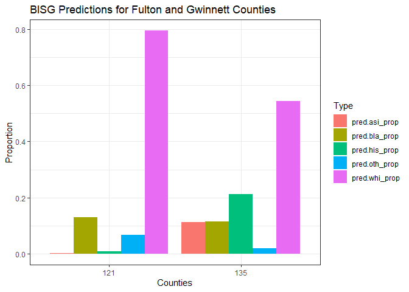
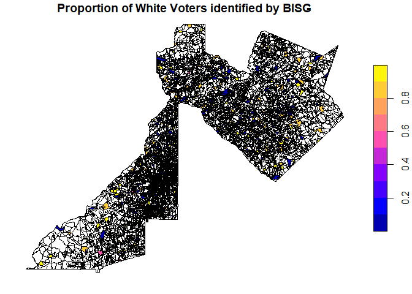
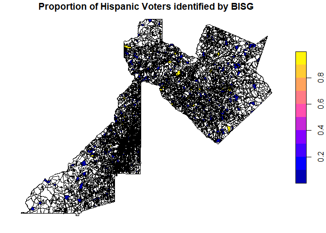
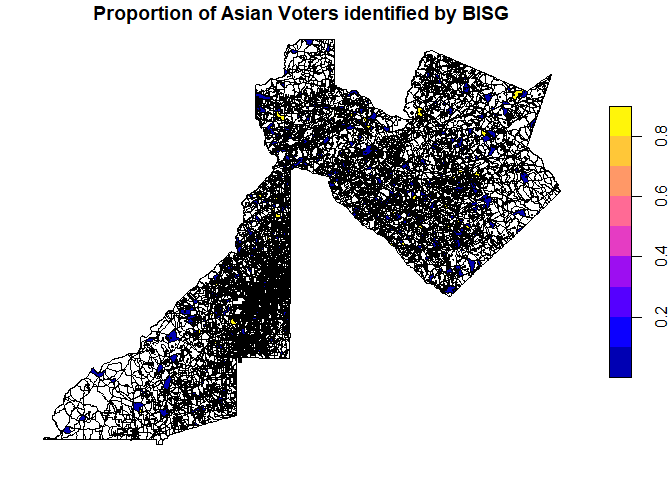

This tutorial demonstrates how to perform Bayesian Improved Surname
Geocoding when the race/ethncity of individuals are unknown within a
dataset.

## What is Bayesian Improved Surname Geocoding?

Bayesian Improved Surname Geocoding (BISG) is a method that applies
Bayes’ Rule to predict the race/ethnicity of an individual using the
individual’s surname and geocoded location [Elliott et. al 2008, Elliot
et al. 2009, Imai and Khanna 2016\].

Specifically, BISG first calculates the prior probability of individual *i* being of a ceratin racial group *r* given their surname *s* or
*P* *r* ( *R* <sub> *i*</sub> =  *r* \| *S* <sub> *i* </sub> =  *s* )
. The prior probability created from the surname is then updated with
the probability of the individual *i* living in a geographic location
*g* belonging to a racial group *r*, or
*P* *r* ( *G* <sub> *i* </sub> =  *g* \| *R* <sub> *i* </sub> =  *r* )
). The following equation describes how BISG calculates race/ethnicity
of individuals using Bayes Theorem, given the surname and geographic
location, and specifically when race/ethnicity is unknown :

$$Pr(R_i=r\|S_i=s, G_i=g)= \\frac {Pr(G_i= g\|R_i =r)Pr(R_i =r \|S_i= s)}{\\sum\_{i=1}^n Pr(G_i= g\|R_i =r)Pr(R_i =r \|S_i= s)}$$

In R, the `wru` package titled, [WRU: Who Are
You](https://cran.r-project.org/web/packages/wru/index.html) performs
BISG. This vignette will walk you through how to prepare your geocoded
voter file for performing BISG by stepping you through the process of
cleaning your voter file, prepping voter data for running the BISG, and
finally, performing BISG to obtain racial/ethnic probailities of
individuals in a voter file.

## Performing BISG on your data

We will perform BISG using the previous Gwinnett and Fulton county voter
registration data called `ga_geo.csv` that was geocoded in the
**eiCompare: Geocoding vignette**.

The first step in performing BISG is to geocode your voter file
addresses. For information on geocoding, visit the Geocoding Vignette.

Let’s begin by loading your geocoded voter data into R/RStudio.

### Step 1: Load R libraries/packages, voter file, and census data

Load the R packages needed to perform BISG. If you have not already
downloaded the following packages, please install these packages.

``` r
# Load libraries
suppressPackageStartupMessages({
  library(eiCompare)
  library(stringr)
  library(sf)
  library(wru)
  library(tigris)
  library(tidyr)
  library(ggplot2)
})
```

Load in census data, the shape file and geocoded voter registation data
with latitude and longitude coordinates.

``` r
# Load Georgia census data
data(georgia_census)
```

We will use the `data(gwin_fulton_shape)` to load the shape file. The
shape file includes FIPS code information for Gwinnett and Fulton
counties and the associated multipolygon shape geometries indicated by
the `geometry` column.

``` r
# Shape file for Gwinnett and Fulton counties
data(gwin_fulton_shape)
```

##### Loading a shapefile using the `tigris` package (optional)

The shapefile can also be loaded using the tigris package. The tigris
package uses the US Census Bureau’s Geocoding API which is publicly
available so no API key is needed. With the tigris package, you can load
your census data according to a geographic level (i.e. counties, cities,
tracts, blocks, etc.) There is additional code below that you can use if
wanting to load your shape file using tigris. Remember to remove the \#
in order to use the code.

``` r
#install.packages("tigris")
#library(tigris)
gwin_fulton_shape <- blocks(state = "GA", county = c("Gwinnett", "Fulton"))
```

Load geocoded voter file.

``` r
# Load geocoded voter registration file
data(ga_geo)
```

Obtain the first six rows of the voter file to check that the file has
downloaded properly.

``` r
# Check the first six rows of the voter file
head(ga_geo, 6)
#> # A tibble: 6 x 25
#>   county_code county_name registration_number voter_status last_name first_name
#>         <dbl> <chr>                     <dbl> <chr>        <chr>     <chr>     
#> 1          60 Fulton                        1 A            LOCKLER   GABRIELLA 
#> 2          60 Fulton                        2 A            RADLEY    OLIVIA    
#> 3          60 Fulton                        3 A            BOORSE    KEISHA    
#> 4          67 Gwinnett                     12 A            MAZ       SAVANNAH  
#> 5          67 Gwinnett                     13 A            GAULE     NATASHIA  
#> 6          67 Gwinnett                     15 A            MCMELLEN  ISMAEL    
#> # ... with 19 more variables: str_num <dbl>, str_name <chr>, str_suffix <chr>,
#> #   city <chr>, state <chr>, zipcode <dbl>, street_address <chr>,
#> #   final_address <chr>, cxy_address <chr>, cxy_status <chr>,
#> #   cxy_quality <chr>, cxy_matched_address <chr>, cxy_tiger_line_id <dbl>,
#> #   cxy_tiger_side <chr>, STATEFP10 <chr>, COUNTYFP10 <chr>, TRACTCE10 <chr>,
#> #   BLOCKCE10 <chr>, geometry <chr>
```

View the column names of the voter file. Some of these columns will be
used along the journey to performing BISG.

``` r
# Find out names of columns in voter file
names(ga_geo)
#>  [1] "county_code"         "county_name"         "registration_number"
#>  [4] "voter_status"        "last_name"           "first_name"         
#>  [7] "str_num"             "str_name"            "str_suffix"         
#> [10] "city"                "state"               "zipcode"            
#> [13] "street_address"      "final_address"       "cxy_address"        
#> [16] "cxy_status"          "cxy_quality"         "cxy_matched_address"
#> [19] "cxy_tiger_line_id"   "cxy_tiger_side"      "STATEFP10"          
#> [22] "COUNTYFP10"          "TRACTCE10"           "BLOCKCE10"          
#> [25] "geometry"
```

Check the dimensions (the number of rows and columns) of the voter file.

``` r
# Get the dimensions of the voter file
dim(ga_geo)
#> [1] 12 25
```

There are 12 voters (or observations) and 25 columns in the voter file.

Convert geometry column name into two columns for latitude and longitude
points.

``` r
ga_geo <- ga_geo %>%
  tidyr::extract(geometry, c("lon", "lat"), "\\((.*), (.*)\\)", convert = TRUE)
```

### Step 2: De-duplicate the voter file.

The next step involves removing duplicate voter IDs from the voter file,
using the `dedupe_voter_file` function.

``` r
# Remove duplicate voter IDs (the unique identifier for each voter)
voter_file_dedupe <- dedupe_voter_file(voter_file = ga_geo, voter_id = "registration_number")
```

There are no duplicate voter IDs in the dataset.

### Step 3: Perform BISG and obtain the predicted race/ethnicity of each voter.

``` r
# Convert the voter_shaped_merged file into a data frame for performing BISG.
voter_file_complete <- as.data.frame(voter_file_dedupe)
class(voter_file_complete)
#> [1] "data.frame"
```

``` r
# Perform BISG
bisg_df <- eiCompare::wru_predict_race_wrapper(
  voter_file = voter_file_complete,
  census_data = georgia_census,
  voter_id = "registration_number",
  surname = "last_name",
  state = "GA",
  county = "COUNTYFP10",
  tract = "TRACTCE10",
  block = "BLOCKCE10",
  census_geo = "block",
  use_surname = TRUE,
  surname_only = FALSE,
  surname_year = 2010,
  use_age = FALSE,
  use_sex = FALSE,
  return_surname_flag = TRUE,
  return_geocode_flag = TRUE,
  verbose = TRUE
)
#> Matching surnames.
#> Performing BISG to obtain race probabilities.
#> Some voters failed geocode matching. Matching at a higher level.
#> BISG complete.
```

``` r
# Check BISG dataframe
head(bisg_df)
#>   county_code county_name registration_number voter_status last_name first_name
#> 1          60      Fulton                   1            A   LOCKLER  GABRIELLA
#> 2          60      Fulton                   2            A    RADLEY     OLIVIA
#> 3          60      Fulton                   3            A    BOORSE     KEISHA
#> 4          67    Gwinnett                  12            A       MAZ   SAVANNAH
#> 5          67    Gwinnett                  13            A     GAULE   NATASHIA
#> 6          67    Gwinnett                  15            A  MCMELLEN     ISMAEL
#>   str_num            str_name str_suffix       city state zipcode
#> 1    1084   Howell Mill Rd NW         NW    Atlanta    GA   30318
#> 2    7305 Village Center Blvd       <NA>   Fairburn    GA   30213
#> 3    6200  Bakers Ferry Rd SW         SW    Atlanta    GA   30331
#> 4    1359    Beaver Ruin Road       <NA>   Norcross    GA   30093
#> 5    2961    Lenora Church Rd       <NA> Snellville    GA   30078
#> 6    4305           Paxton Ln       <NA>    Lilburn    GA   30047
#>               street_address                               final_address
#> 1  1084 Howell Mill Rd NW NW  1084 Howell Mill Rd NW NW,Atlanta,GA,30318
#> 2   7305 Village Center Blvd  7305 Village Center Blvd,Fairburn,GA,30213
#> 3 6200 Bakers Ferry Rd SW SW 6200 Bakers Ferry Rd SW SW,Atlanta,GA,30331
#> 4      1359 Beaver Ruin Road     1359 Beaver Ruin Road,Norcross,GA,30093
#> 5      2961 Lenora Church Rd   2961 Lenora Church Rd,Snellville,GA,30078
#> 6             4305 Paxton Ln             4305 Paxton Ln,Lilburn,GA,30047
#>                                      cxy_address cxy_status cxy_quality
#> 1  1084 Howell Mill Rd NW NW, Atlanta, GA, 30318      Match   Non_Exact
#> 2 7305 Village Center Blvd , Fairburn, GA, 30213      Match       Exact
#> 3 6200 Bakers Ferry Rd SW SW, Atlanta, GA, 30331      Match       Exact
#> 4    1359 Beaver Ruin Road , Norcross, GA, 30093      Match       Exact
#> 5  2961 Lenora Church Rd , Snellville, GA, 30078      Match       Exact
#> 6            4305 Paxton Ln , Lilburn, GA, 30047      Match       Exact
#>                             cxy_matched_address cxy_tiger_line_id
#> 1       1084 HOWELL MILL RD, ATLANTA, GA, 30318          17341994
#> 2 7305 VILLAGE CENTER BLVD, FAIRBURN, GA, 30213         650118829
#> 3   6200 BAKERS FERRY RD SW, ATLANTA, GA, 30331          17378238
#> 4      1359 BEAVER RUIN RD, NORCROSS, GA, 30093         638089058
#> 5  2961 LENORA CHURCH RD, SNELLVILLE, GA, 30078         647930651
#> 6            4305 PAXTON LN, LILBURN, GA, 30047          88948522
#>   cxy_tiger_side STATEFP10 COUNTYFP10 TRACTCE10 BLOCKCE10       lon      lat
#> 1              L        13        121    000600      1064 -84.41194 33.78431
#> 2              L        13        121    010514      3038 -84.59827 33.55365
#> 3              L        13        121    010303      2019 -84.57126 33.72542
#> 4              L        13        135    050424      1011 -84.14037 33.92892
#> 5              R        13        135    050719      1008 -84.00938 33.83915
#> 6              R        13        135    050714      2027 -84.07677 33.83707
#>   matched_surname matched_geocode  pred.whi    pred.bla    pred.his    pred.asi
#> 1            TRUE           FALSE 0.8237761 0.009014951 0.003637150 0.000000000
#> 2            TRUE            TRUE 0.5729471 0.377042658 0.010292047 0.001016964
#> 3            TRUE            TRUE 0.9892441 0.000000000 0.009118836 0.001637051
#> 4            TRUE            TRUE 0.1359691 0.020481368 0.712975611 0.125118385
#> 5            TRUE            TRUE 0.8983891 0.036503456 0.065107439 0.000000000
#> 6            TRUE            TRUE 0.9205111 0.021682048 0.026553359 0.012172791
#>      pred.oth
#> 1 0.163571753
#> 2 0.038701199
#> 3 0.000000000
#> 4 0.005455516
#> 5 0.000000000
#> 6 0.019080702
```

## Summarizing BISG output

``` r
summary(bisg_df)
#>   county_code    county_name        registration_number voter_status      
#>  Min.   :60.00   Length:12          Min.   : 1.00       Length:12         
#>  1st Qu.:65.25   Class :character   1st Qu.: 9.00       Class :character  
#>  Median :67.00   Mode  :character   Median :14.00       Mode  :character  
#>  Mean   :65.25                      Mean   :12.25                         
#>  3rd Qu.:67.00                      3rd Qu.:17.25                         
#>  Max.   :67.00                      Max.   :20.00                         
#>   last_name          first_name           str_num       str_name        
#>  Length:12          Length:12          Min.   : 287   Length:12         
#>  Class :character   Class :character   1st Qu.:1394   Class :character  
#>  Mode  :character   Mode  :character   Median :3498   Mode  :character  
#>                                        Mean   :3306                     
#>                                        3rd Qu.:4162                     
#>                                        Max.   :7305                     
#>   str_suffix            city              state              zipcode     
#>  Length:12          Length:12          Length:12          Min.   :30045  
#>  Class :character   Class :character   Class :character   1st Qu.:30078  
#>  Mode  :character   Mode  :character   Mode  :character   Median :30095  
#>                                                           Mean   :30167  
#>                                                           3rd Qu.:30239  
#>                                                           Max.   :30518  
#>  street_address     final_address      cxy_address         cxy_status       
#>  Length:12          Length:12          Length:12          Length:12         
#>  Class :character   Class :character   Class :character   Class :character  
#>  Mode  :character   Mode  :character   Mode  :character   Mode  :character  
#>                                                                             
#>                                                                             
#>                                                                             
#>  cxy_quality        cxy_matched_address cxy_tiger_line_id   cxy_tiger_side    
#>  Length:12          Length:12           Min.   : 17341994   Length:12         
#>  Class :character   Class :character    1st Qu.: 88908516   Class :character  
#>  Mode  :character   Mode  :character    Median :637257860   Mode  :character  
#>                                         Mean   :399987381                     
#>                                         3rd Qu.:641834456                     
#>                                         Max.   :650118829                     
#>   STATEFP10          COUNTYFP10         TRACTCE10          BLOCKCE10        
#>  Length:12          Length:12          Length:12          Length:12         
#>  Class :character   Class :character   Class :character   Class :character  
#>  Mode  :character   Mode  :character   Mode  :character   Mode  :character  
#>                                                                             
#>                                                                             
#>                                                                             
#>       lon              lat        matched_surname matched_geocode
#>  Min.   :-84.60   Min.   :33.55   Mode:logical    Mode :logical  
#>  1st Qu.:-84.23   1st Qu.:33.82   TRUE:12         FALSE:2        
#>  Median :-84.14   Median :33.89                   TRUE :10       
#>  Mean   :-84.19   Mean   :33.88                                  
#>  3rd Qu.:-84.04   3rd Qu.:33.97                                  
#>  Max.   :-83.97   Max.   :34.09                                  
#>     pred.whi          pred.bla           pred.his          pred.asi        
#>  Min.   :0.02451   Min.   :0.000000   Min.   :0.00000   Min.   :0.0000000  
#>  1st Qu.:0.11931   1st Qu.:0.006878   1st Qu.:0.00648   1st Qu.:0.0004762  
#>  Median :0.84711   Median :0.021082   Median :0.01842   Median :0.0022538  
#>  Mean   :0.60661   Mean   :0.117152   Mean   :0.16050   Mean   :0.0845627  
#>  3rd Qu.:0.92706   3rd Qu.:0.045499   3rd Qu.:0.06795   3rd Qu.:0.0085467  
#>  Max.   :0.99879   Max.   :0.833171   Max.   :0.96652   Max.   :0.8582927  
#>     pred.oth       
#>  Min.   :0.000000  
#>  1st Qu.:0.001092  
#>  Median :0.018686  
#>  Mean   :0.031178  
#>  3rd Qu.:0.041653  
#>  Max.   :0.163572
```

### Look at BISG race predictions by county

``` r
# Obtain aggregate values for the BISG results by county
bisg_agg <- precinct_agg_combine(
  voter_file = bisg_df,
  group_col = "COUNTYFP10",
  race_cols = c("pred.whi", "pred.bla", "pred.his", "pred.asi", "pred.oth"),
  true_race_col = "race",
  include_total = FALSE
)
# Table with BISG race predictions by county
head(bisg_agg)
#> # A tibble: 2 x 6
#>   COUNTYFP10 pred.whi_prop pred.bla_prop pred.his_prop pred.asi_prop
#>   <chr>              <dbl>         <dbl>         <dbl>         <dbl>
#> 1 121                0.795         0.129       0.00768      0.000885
#> 2 135                0.544         0.113       0.211        0.112   
#> # ... with 1 more variable: pred.oth_prop <dbl>
```

### Barplot of BISG results

``` r
bisg_bar <- bisg_agg %>%
  tidyr::gather("Type", "Value", -COUNTYFP10) %>%
  ggplot(aes(COUNTYFP10, Value, fill = Type)) +
  geom_bar(position = "dodge", stat = "identity") +
  labs(title = "BISG Predictions for Fulton and Gwinnett Counties", y = "Proportion", x = "Counties") +
  theme_bw()
bisg_bar + scale_color_discrete(name = "Race/Ethnicity Proportions")
```



### Choropleth Map

Finally, we will map the BISG data onto choropleth maps.

``` r
bisg_dfsub <- bisg_df %>%
  dplyr::select(BLOCKCE10, pred.whi, pred.bla, pred.his, pred.asi, pred.oth)
bisg_dfsub
#>    BLOCKCE10   pred.whi     pred.bla    pred.his     pred.asi     pred.oth
#> 1       1064 0.82377615 0.0090149512 0.003637150 0.0000000000 0.1635717534
#> 2       3038 0.57294713 0.3770426578 0.010292047 0.0010169636 0.0387011992
#> 3       2019 0.98924411 0.0000000000 0.009118836 0.0016370506 0.0000000000
#> 4       1011 0.13596912 0.0204813677 0.712975611 0.1251183852 0.0054555160
#> 5       1008 0.89838911 0.0365034556 0.065107439 0.0000000000 0.0000000000
#> 6       2027 0.92051110 0.0216820481 0.026553359 0.0121727909 0.0190807020
#> 7       3010 0.94671727 0.0250984844 0.007406000 0.0005243999 0.0202538442
#> 8       1011 0.02864578 0.8331715264 0.076494182 0.0054496100 0.0562388974
#> 9       4002 0.99878948 0.0000000000 0.000000000 0.0003314061 0.0008791115
#> 10      2002 0.02451244 0.0004654454 0.966521381 0.0073380451 0.0011626903
#> 11      3000 0.87043574 0.0724838628 0.003703068 0.0028704676 0.0505068617
#> 12      3003 0.06934748 0.0098779920 0.044191056 0.8582926964 0.0182907761
```

``` r
# Join bisg and shape file
bisg_sf <- dplyr::left_join(gwin_fulton_shape, bisg_dfsub, by = "BLOCKCE10")
```

#### Plot Map of Proportion of Black Voters

``` r
# Plot choropleth map of race/ethnicity predictions for Fulton and Gwinnett counties
plot(bisg_sf["pred.bla"], main = "Proportion of Black Voters identified by BISG")
```


#### Plot Map of Proportion of White Voters

``` r
plot(bisg_sf["pred.whi"], main = "Proportion of White Voters identified by BISG")
```



#### Plot Map of Proportion of Hispanic Voters

``` r
plot(bisg_sf["pred.his"], main = "Proportion of Hispanic Voters identified by BISG")
```



#### Plot Map of Proportion of Asian Voters

``` r
plot(bisg_sf["pred.asi"], main = "Proportion of Asian Voters identified by BISG")
```



#### Plot Map of Proportion of Other Voters

``` r
plot(bisg_sf["pred.oth"], main = "Proportion of 'Other' Voters identified by BISG")
```


