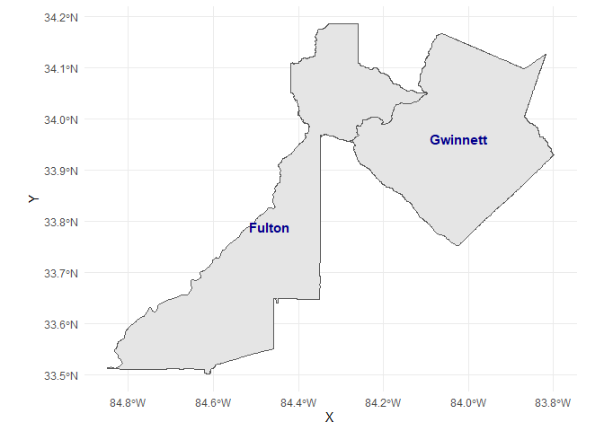
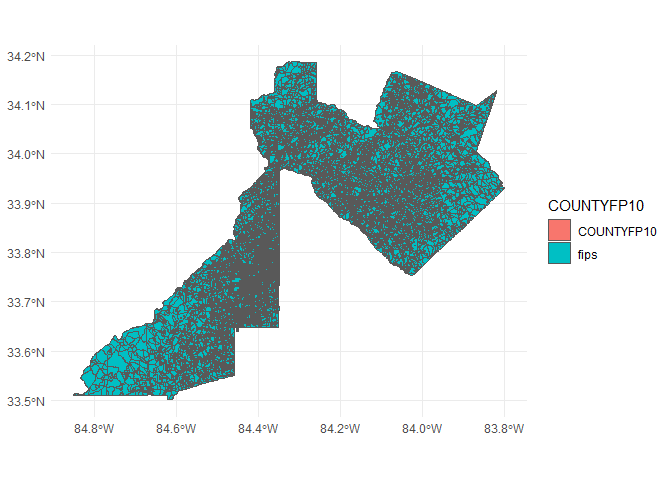
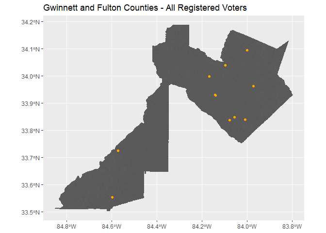

In this vignette, we will walk-through how to geocode a dataset that
includes addresses used to apply the BISG method for estimating the
race/ethnicity of registered voters.

## What is Geocoding?

One of the first steps to performing ecological inference using
eiCompare is geocoding your voter file addresses in order to perform
Bayesian Improved Surname Geocoding (BISG). Geocoding is the process of
using an address or place of location to find geographic coordinates
(i.e. latitude/longitude) of that location on a map. In relation to
performing BISG, the values of the geographic coordinates are compared
to other census data containing self-reported race and ethnicity to
determine the likelihood of an individual living in an ecological unit
area (i.e. county, block, tract) being of a certain race given their
address. This probability is then used to update a prior probability in
the BISG analysis. For more information on BISG, please refer to the
BISG vignette. Below are some steps to help you walk through the process
of performing geocoding on your voter file.

### <u>Step 1: Load R libraries/packages</u>

Each library/package loaded allows you to use certain functions needed
to prep your data for geocoding and run the geocoding tool(s).

``` r
library(eiCompare)
library(stringr)
library(tidyverse)
library(tigris)
library(tidyr)
library(foreach)
library(parallel)
library(doParallel)
library(data.table)
library(plyr)
library(censusxy)
library(sf)
library(leaflet)
```

### <u>Step 2: Load your voter data.</u>

We are using a toy dataset representing the Georgia and Fulton county
voter registration and geocoding all voter addresses.

``` r
# Create toy dataset for Fulton and Gwinnett counties in Georgia
county_code <- c(rep(60, 10), rep(67, 10))
county_name <- c(rep("Fulton", 10), rep("Gwinnett", 10))
registration_number <- c(1:20)
voter_status <- c(rep("A", 20))

last_name <- c(
  "LOCKLER", "RADLEY", "BOORSE", "DEL RAY", "MUSHARBASH", "HILLEBRANDT", "HELME",
  "GILBRAITH", "RUKA", "JUBINVILLE", "HE", "MAZ", "GAULE", "BOETTICHER", "MCMELLEN",
  "RIDEOUT", "WASHINGTON", "KULENOVIC", "HERNANDEZ", "LONG"
)
first_name <- c(
  "GABRIELLA", "OLIVIA", "KEISHA", "ALEX", "NADIA", "LAILA", "ELSON", "JOY",
  "MATTHEW", "KENNEDY", "JOSE", "SAVANNAH", "NATASHIA", "SEAN", "ISMAEL",
  "LUQMAN", "BRYN", "EVELYN", "SAMANTHA", "BESSIE"
)

str_num <- c(
  "1084", "7305", "6200", "6500", "1073", "100", "125", "6425", "6850", "900",
  "287", "1359", "2961", "1525", "4305", "3530", "1405", "4115", "3465", "3655"
)
str_name <- c(
  "Howell Mill Rd NW", "Village Center Blvd", "Bakers Ferry Rd SW", "Aria Blvd",
  "Jameson Pass", "Hollywood Rd NW", "Autumn Ridge Trl", "Hammond Dr NE",
  "Oakley Rd", "Peachtree Dunwoody Rd", "E Crogan St", "Beaver Ruin Road",
  "Lenora Church Rd", "Station Center Blvd", "Paxton Ln", "Parkwood Hills Ct",
  "Beaver Ruin Rd", "S Lee St", "Duluth Highway 120", "Peachtree Industrial Blvd"
)
str_suffix <- c(
  "NW", NA, "SW", NA, NA, "NW", NA, "NE", NA, NA,
  NA, NA, NA, NA, NA, NA, NA, NA, NA, NA
)
city <- c(
  "Atlanta", "Fairburn", "Atlanta", "Sandy Springs", "Atlanta", "Roswell",
  "Sandy Springs", "Union City", "Sandy Springs", "Alpharetta", "Lawrenceville",
  "Norcross", "Snellville", "Suwanee", "Lilburn", "Snellville", "Norcross",
  "Buford", "Duluth", "Duluth"
)
state <- "GA"
zipcode <- c(
  "30318", "30213", "30331", "30328", "30318", "30076", "30328",
  "30291", "30328", "30022", "30045", "30093", "30078", "30024",
  "30047", "30078", "30093", "30518", "30096", "30096"
)


voter_data <- data.frame(
  county_code, county_name, registration_number, voter_status, last_name, first_name,
  str_num, str_name, str_suffix, city, state, zipcode
)
```

Check the voter registration file, `voter_data`, to make sure the
dataset has properly downloaded.

``` r
# Check dimensions of the dataset
dim(voter_data)

# Check first 6 rows
head(voter_data, 6)

# Check the column names of the file
names(voter_data)
```

Prepare/Structure your voter data for geocoding.

``` r
# Concatenate columns for street address.
voter_data <- concat_streetname(
  voter_file = voter_data,
  street_number = "str_num",
  street_name = "str_name",
  street_suffix = "str_suffix"
)
```

Create a column for the final address in the voter file.

``` r
# Create a final address. This address can also be used if you are geocoding with the Opencage API.

voter_data <- concat_final_address(
  voter_file = voter_data,
  street_address = "street_address",
  city = "city",
  state = "state",
  zipcode = "zipcode"
)
```

``` r
# convert dataframe into a tibble
voter_data <- as_tibble(voter_data)
```

### <u>Step 3: run_geocoder() Function</u>

#### <b>Select a geocoder and run the geocoder on the addresses in your file.</b>

Select the geocoder you are going to use to find the geographies like
coordinates (i.e. latitude and longitude) and FIPS codes for the
addresses in the voter file. There are several options for geocoding
your data using a geocoding API. The eiCompare package utilizes the US
Census Geocding API via a R package called censusxy. For an alternative
commerically available geocoder, we recommend using Opencage Geocoder
API which has limits of 2500 requests per day.

Note: You have to have at least 4 CPU cores to use the parallel
processing option. If you have more than 10,000 voters in your file, we
recommend using parallel processing. More information on parallel
processing can be found on the Parallel Processing vignette.

#### <b>Let’s start geocoding our data</b>

We recommend first geocoding your data with the US Census Geocoder API
via the R package, censusxy.

The US Census Geocoder has two options for geocoding output: “simple”
and “full”.

-   “simple” returns coordinates of latitude (lat) and longitude.
-   “full” returns coordinates, and other variables for geographies from
    Federal Information Processing Standards (FIPS) codes.

To get the latitude and longitude only, we will set the `census_output`
variable to “simple” and assign each census variable to a desired value.

``` r
# Getting the latitude and longitude coordinates only.
geocoded_data_simple <- run_geocoder(
  voter_file = voter_data,
  geocoder = "census",
  parallel = FALSE,
  voter_id = "registration_number",
  street = "street_address",
  city = "city",
  state = "state",
  zipcode = "zipcode",
  country = "US",
  census_return = "locations",
  census_benchmark = "Public_AR_Current",
  census_output = "simple",
  census_class = "sf",
  census_vintage = 4,
  opencage_key = NULL
)
```

Check the column names of the geocoded dataset. There should be an
additional column called `geometry` with latitude, and longitude
coordinates.

``` r
colnames(geocoded_data_simple)
```

    ##  [1] "county_code"         "county_name"         "registration_number"
    ##  [4] "voter_status"        "last_name"           "first_name"         
    ##  [7] "str_num"             "str_name"            "str_suffix"         
    ## [10] "city"                "state"               "zipcode"            
    ## [13] "street_address"      "final_address"       "geometry"

Next, we will use parallel processing to make our geocoder run faster by
setting `parallel`=`TRUE` and obtain simple geographies by setting
`census_output`=“simple”.

``` r
# Getting the latitude and longitude coordinates only.
geocoded_data_simple_para <- run_geocoder(
  voter_file = voter_data,
  geocoder = "census",
  parallel = TRUE,
  voter_id = "registration_number",
  street = "street_address",
  city = "city",
  state = "state",
  zipcode = "zipcode",
  country = "US",
  census_return = "locations",
  census_benchmark = "Public_AR_Current",
  census_output = "simple",
  census_class = "sf",
  census_vintage = 4,
  opencage_key = NULL
)
```

The voter file now includes latitude and longitude points.

``` r
head(geocoded_data_simple_para)
```

    ## Simple feature collection with 6 features and 14 fields
    ## Geometry type: POINT
    ## Dimension:     XY
    ## Bounding box:  xmin: -84.59826 ymin: 33.55363 xmax: -83.97175 ymax: 34.03886
    ## Geodetic CRS:  NAD83
    ##    county_code county_name registration_number voter_status  last_name
    ## 19          60      Fulton                   2            A     RADLEY
    ## 15          60      Fulton                   3            A     BOORSE
    ## 8           67    Gwinnett                  11            A         HE
    ## 5           67    Gwinnett                  12            A        MAZ
    ## 9           67    Gwinnett                  13            A      GAULE
    ## 7           67    Gwinnett                  14            A BOETTICHER
    ##    first_name str_num            str_name str_suffix          city state
    ## 19     OLIVIA    7305 Village Center Blvd       <NA>      Fairburn    GA
    ## 15     KEISHA    6200  Bakers Ferry Rd SW         SW       Atlanta    GA
    ## 8        JOSE     287         E Crogan St       <NA> Lawrenceville    GA
    ## 5    SAVANNAH    1359    Beaver Ruin Road       <NA>      Norcross    GA
    ## 9    NATASHIA    2961    Lenora Church Rd       <NA>    Snellville    GA
    ## 7        SEAN    1525 Station Center Blvd       <NA>       Suwanee    GA
    ##    zipcode             street_address
    ## 19   30213  7305 Village Center Blvd 
    ## 15   30331 6200 Bakers Ferry Rd SW SW
    ## 8    30045           287 E Crogan St 
    ## 5    30093     1359 Beaver Ruin Road 
    ## 9    30078     2961 Lenora Church Rd 
    ## 7    30024  1525 Station Center Blvd 
    ##                                  final_address                   geometry
    ## 19  7305 Village Center Blvd,Fairburn,GA,30213 POINT (-84.59826 33.55363)
    ## 15 6200 Bakers Ferry Rd SW SW,Atlanta,GA,30331 POINT (-84.57107 33.72506)
    ## 8       287 E Crogan St,Lawrenceville,GA,30045 POINT (-83.97175 33.96184)
    ## 5      1359 Beaver Ruin Road,Norcross,GA,30093 POINT (-84.14037 33.92892)
    ## 9    2961 Lenora Church Rd,Snellville,GA,30078 POINT (-84.00938 33.83915)
    ## 7    1525 Station Center Blvd,Suwanee,GA,30024 POINT (-84.09696 34.03886)

Using parallel processing, we geocoded addresses much faster, even
though the difference is seconds apart. We will now demonstrate how to
add the the coordinates and FIPS codes by setting the `census_output`
variable to “full”.

``` r
geocoded_data_full_geo <- run_geocoder(
  voter_file = voter_data,
  geocoder = "census",
  parallel = TRUE,
  voter_id = "registration_number",
  street = "street_address",
  city = "city",
  state = "state",
  zipcode = "zipcode",
  country = "US",
  census_return = "geographies",
  census_benchmark = "Public_AR_Current",
  census_output = "full",
  census_class = "sf",
  census_vintage = 4,
  opencage_key = NULL
)
```

The `geocoded_data_full_geo` should be an additional column called
`geometry` with latitude, longitude coordinates, and other variables for
geographies.

``` r
# Check the first six rows of the geocoded_dataset object
head(geocoded_data_full_geo)
```

    ## Simple feature collection with 6 features and 24 fields
    ## Geometry type: POINT
    ## Dimension:     XY
    ## Bounding box:  xmin: -84.59826 ymin: 33.55363 xmax: -83.97175 ymax: 34.03886
    ## Geodetic CRS:  NAD83
    ##    county_code county_name registration_number voter_status  last_name
    ## 19          60      Fulton                   2            A     RADLEY
    ## 15          60      Fulton                   3            A     BOORSE
    ## 8           67    Gwinnett                  11            A         HE
    ## 5           67    Gwinnett                  12            A        MAZ
    ## 9           67    Gwinnett                  13            A      GAULE
    ## 7           67    Gwinnett                  14            A BOETTICHER
    ##    first_name str_num            str_name str_suffix          city state
    ## 19     OLIVIA    7305 Village Center Blvd       <NA>      Fairburn    GA
    ## 15     KEISHA    6200  Bakers Ferry Rd SW         SW       Atlanta    GA
    ## 8        JOSE     287         E Crogan St       <NA> Lawrenceville    GA
    ## 5    SAVANNAH    1359    Beaver Ruin Road       <NA>      Norcross    GA
    ## 9    NATASHIA    2961    Lenora Church Rd       <NA>    Snellville    GA
    ## 7        SEAN    1525 Station Center Blvd       <NA>       Suwanee    GA
    ##    zipcode             street_address
    ## 19   30213  7305 Village Center Blvd 
    ## 15   30331 6200 Bakers Ferry Rd SW SW
    ## 8    30045           287 E Crogan St 
    ## 5    30093     1359 Beaver Ruin Road 
    ## 9    30078     2961 Lenora Church Rd 
    ## 7    30024  1525 Station Center Blvd 
    ##                                  final_address
    ## 19  7305 Village Center Blvd,Fairburn,GA,30213
    ## 15 6200 Bakers Ferry Rd SW SW,Atlanta,GA,30331
    ## 8       287 E Crogan St,Lawrenceville,GA,30045
    ## 5      1359 Beaver Ruin Road,Norcross,GA,30093
    ## 9    2961 Lenora Church Rd,Snellville,GA,30078
    ## 7    1525 Station Center Blvd,Suwanee,GA,30024
    ##                                       cxy_address cxy_status cxy_quality
    ## 19 7305 Village Center Blvd , Fairburn, GA, 30213      Match       Exact
    ## 15 6200 Bakers Ferry Rd SW SW, Atlanta, GA, 30331      Match       Exact
    ## 8      287 E Crogan St , Lawrenceville, GA, 30045      Match   Non_Exact
    ## 5     1359 Beaver Ruin Road , Norcross, GA, 30093      Match       Exact
    ## 9   2961 Lenora Church Rd , Snellville, GA, 30078      Match       Exact
    ## 7   1525 Station Center Blvd , Suwanee, GA, 30024      Match       Exact
    ##                              cxy_matched_address cxy_tiger_line_id
    ## 19 7305 VILLAGE CENTER BLVD, FAIRBURN, GA, 30213         650118829
    ## 15   6200 BAKERS FERRY RD SW, ATLANTA, GA, 30331          17378238
    ## 8      287 E CROGAN ST, LAWRENCEVILLE, GA, 30046         647919504
    ## 5       1359 BEAVER RUIN RD, NORCROSS, GA, 30093         638089058
    ## 9   2961 LENORA CHURCH RD, SNELLVILLE, GA, 30078         647930651
    ## 7   1525 STATION CENTER BLVD, SUWANEE, GA, 30024         636429076
    ##    cxy_tiger_side cxy_state_id cxy_county_id cxy_tract_id cxy_block_id
    ## 19              L           13           121        10519         2011
    ## 15              L           13           121        10312         2020
    ## 8               R           13           135        50569         1014
    ## 5               L           13           135        50453         1000
    ## 9               R           13           135        50719         1000
    ## 7               R           13           135        50223         3007
    ##                      geometry
    ## 19 POINT (-84.59826 33.55363)
    ## 15 POINT (-84.57107 33.72506)
    ## 8  POINT (-83.97175 33.96184)
    ## 5  POINT (-84.14037 33.92892)
    ## 9  POINT (-84.00938 33.83915)
    ## 7  POINT (-84.09696 34.03886)

If there are any missing geocoded addresses, use the run_geocoder()
function to re-run the geocoder on those missing geocoded addresses. We
will use the `geocoded_data_full_geo` data to demonstrate how to re-run
the geocoder on missing addresses.

``` r
# The number of rows missing in new dataframe
num_miss_geo <- nrow(voter_data) - nrow(geocoded_data_full_geo)

# Only re-run the geocoder if missing data is present.
if (num_miss_geo > 0) {

  # Find non-geocoded data
  missing_lonlat_df <- anti_join(voter_data, as.data.frame(geocoded_data_full_geo))

  # Run the geocoder on the missing data
  rerun_data <- run_geocoder(
    voter_file = missing_lonlat_df,
    geocoder = "census",
    parallel = TRUE,
    voter_id = "registration_number",
    street = "street_address",
    city = "city",
    state = "state",
    zipcode = "zipcode",
    country = "US",
    census_return = "geographies",
    census_benchmark = "Public_AR_Current",
    census_output = "full",
    census_class = "sf",
    census_vintage = 4,
    opencage_key = NULL
  )
}
```

Some of the missing addresses were able to be geocoded. Next, we will
combine the newly geocoded data from the `rerun_data` object and the
original geocoded data, `geocoded_data`, object.

``` r
geo_combined <- rbind(geocoded_data_full_geo, rerun_data)
```

``` r
# Check the dimensions of the combined geocoded voter registration dataset
dim(geo_combined)
```

    ## [1] 11 25

``` r
# rename columns to US Census FIPS code variable names
names(geo_combined)[names(geo_combined) == "cxy_state_id"] <- "STATEFP10"
names(geo_combined)[names(geo_combined) == "cxy_county_id"] <- "COUNTYFP10"
names(geo_combined)[names(geo_combined) == "cxy_tract_id"] <- "TRACTCE10"
names(geo_combined)[names(geo_combined) == "cxy_block_id"] <- "BLOCKCE10"
```

``` r
geo_combined_df <- as.data.frame(geo_combined)
class(geo_combined_df)
```

    ## [1] "data.frame"

### Step 4: Plot your geocoded data

We will map the area or ecological unit we are interested in using the
tigris package for loading in US Census shapefiles.

``` r
# Load shapefile for the state of Georgia
shape_file <- counties(state = "GA")
```

``` r
# Concatenate the state and county codes into column called fips
shape_file$fips <- paste0(shape_file$STATEFP, shape_file$COUNTYFP)

# Filter shape_file for the counties: Gwinnett and Fulton
shape_file <- shape_file[shape_file$fips == "13121" | shape_file$fips == "13135", ]
shape_file$fulton <- ifelse(shape_file$fips == "13121", 1, 0)
shape_file$gwinnett <- ifelse(shape_file$fips == "13121", 1, 0)
```

``` r
# Map shape_file
county_shape <- map_shape_file(
  shape_file = shape_file,
  crs = "+proj=latlong +ellps=GRS80 +no_defs",
  title = "Gwinnett and Fulton counties"
)
county_shape
```



**We now will look at the block level of Fulton and Gwinnett county.**

``` r
# Load shape file using tidycensus
gwin_fulton_blocks <- blocks(state = "GA", county = c("Gwinnett", "Fulton"))
```

``` r
# Concatenate the state and county codes into column called fips
gwin_fulton_blocks$fips <- paste0(gwin_fulton_blocks$STATEFP, gwin_fulton_blocks$COUNTYFP)
```

``` r
gwin_fulton_map <- map_shape_points(
  voter_file = geo_combined_df,
  shape_file = gwin_fulton_blocks,
  crs = "+proj=longlat +ellps=GRS80",
  title = "Gwinnett and Fulton Counties - All Registered Voters"
)
gwin_fulton_map
```

    ## [[1]]



    ## 
    ## [[2]]


