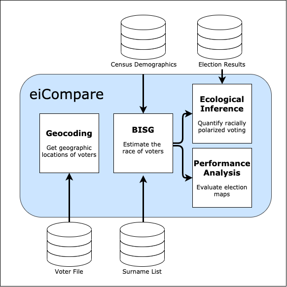

`eiCompare` is an R package built to help practitioners and academics quantify **racially polarized voting (RPV)** with ease and confidence. `eiCompare` was built with several types of users in mind:

-   Expert witnesses in voting rights litigation who need to accurately quantify vote dilution in an area and present the results convincingly to a judge or jury.
-   National voting rights advocacy organizations trying to identify elections across the country where vote dilution might be at play.
-   Grassroots organizations looking for data-driven tools to fuel their fight against vote dilution at the local level.
-   Academics who study the causes and consequences of vote dilution and racially polarized voting.

`eiCompare` implements methods developed through decades of research on the measurement of RPV in US elections. It wraps around existing R packages such as [`ei`]([https://gking.harvard.edu/eiR](https://gking.harvard.edu/eiR)), [`eiPack`](https://www.rdocumentation.org/packages/eiPack/versions/0.1-7), and [`WRU`](https://github.com/kosukeimai/wru), adding a layer of polish, usability and statistical robustness to their foundational tools. Broadly: the package provides users with the following:

- Functions for merging, joining, and transforming data, built specifically for data used along the RPV data science pipeline.
- The statistical tools to rigorously compare different ecological inference estimation methods and different method parameterizations.
- Meaningful representations of statistical uncertainty through the calculation of highest-posterior-density credible intervals for all sampling-based estimation methods.

## What can `eiCompare` do?

`eiCompare` has tools that help at every step of the pipeline for quantifying racially polarized voting:

Users can measure RPV in any election, provided they have access to election results and the corresponding voter file (see below for information about the different types of data needed to measure racially polarized voting). The analysis proceeds via the following pipeline.

1. **Geocoding:** To effectively estimate the race of voters, we need to know the Census block in which they reside. To figure this out, first geocode the addresses of the voters to get latitude and longitude values corresponding to their exact locations on a map. Then, use those locations to figure out the Census block in which they reside.

2. **Bayesian Improved Surname Geocoding (BISG):** We use BISG to estimate the race of voters on the basis of their surnames and the census block in which they reside. Next, use these estimates count how many voters of each race turned out to vote in each election precinct.

3. **Ecological Inference (EI):** We merge our estimates of racial turnout with the actual results of elections in each precinct. Using the estimates of racial turnout and the election results, we can apply EI to estimate the proportion of voters from each racial group voted for each political candidate.

4. **Performance Analysis:** Alternatively, we can use the race estimates from BISG to compare different electoral map proposals and predict how they might affect racial turnout in future elections. 

This process involves a lot of data cleaning, merging different datasets, and doing spatial joins to move between the different steps. `eiCompare` has functions to help with all of these little steps too!

### Data

The data needed to carry-out ecological inference for the `eiCompare` package include a voter file, surname lists, and census data (see figure below). In this section, we discuss what these sources of information are and how they are utilized along the `eiCompare` pipeline.

**What’s in a voter file?**
The voter file is one of the main sources of information needed to perform ecological inference and detect racially polarized voting. The voter file is used (at the individual level) for predicting the race/ethnicity of each voter and geocoding voter addresses to perform Bayesian Improved Surname Analysis (BISG). 

A voter file typically includes the following information:

  * Voter ID
  * Voter registration status
  * Voter status reason
  * First name
  * Last name
  * Birthdate
  * Address
  * District information related to levels of government

Sometimes the voter file contains racial/ethnic information and other demographic information but this varies greatly by state.

The voter file is public information and attainable via a state designated process that can be either requested by a physical and/or online form (see figure below). The process varies by state, can take up to several weeks to obtain, and may include a fee for processing.

#### Census Data
The Census information is used in the `eiCompare` pipeline to obtain self-reported racial demographic information and linked to a specific location for an individual and household. This information is then used in BISG to help predict racial/ethnicity for voters. The census data files used come from a variety of sources such as shape files according to geographic units (i.e. state, county, block, tract, etc.), and census surname lists according to year. For instance, we are using a surname list from 2010.  Thus, the census data is downloaded as  a shapefile and then combined with voter file information to properly infer whether the voter is living in an area that is predominately of a certain racial group. It is also important to note that the identification of racial categories based on census data is limited to  it representing a portion of the population at a given time period and may not represent the true counts of all racial groups in an area. However, census data gives a close account of the racial demographics of an area by count and proportion depending on the ecological unit (i.e. state, county, block, tract, etc.) you are interested in. 

#### Pre-Processing and Cleaning Data

Along the pipeline of obtaining results using `eiCompare`, it is necessary to ensure that the voting file and census data have both been pre-processed and standardized to reduce consequential error in the accuracy of detecting racially polarized voting. In particular, data cleaning involves: properly formatting names and addresses to account for special characters or spacing, the detection of missing information, removing duplicate voter IDs, the simulation of missing information, and visualizations that help detect any discrepancies within the voter file information. We will use the following case of East Ramapo and data from the state of Georgia (which includes race/ethnicity in the voter file) to create R vignettes as a basis for demonstrating how we conduct pre-processing and standardization of the data needed to perform BISG and `eiCompare`. 

## Our contribution:

  Dr. Matt Baretto, Dr. Loren Collingwood, and their co-authors developed `eiCompare` as a  'minimum viable product' while conducting analyses for the East Ramapo court case (view the original package [here](https://github.com/lorenc5/eiCompare)). This summer we worked to revamp the package and demonstrate it's capabilities through a different applications.

### Package improvements

View the new package repository [here](https://github.com/RPVote/eiCompare). A short list of the new additions to the package:

- We added new functionality, including:
	- Performance analysis
	- Tools for geocoding voter file addresses
	- Functions for processing data throughout the pipeline
- We modernized the style, structure, and documentation of the package, preparing it for open-sourced deployment on [CRAN](https://cran.r-project.org/), the software distribution system for the R programming language.
- We added support for parallel processing, resulting in 5X improvements in efficiency.
- We improved handling of statistical uncertainty throughout the pipeline by enabling the propagation of errors from start to finish
- We added new and revamped data visualization functions for presenting results at every step.

### Research and Applications

Beyond upgrading the package, we also applied these tools in additional research work:

- **Performance analysis:** We used eiCompare’s performance analysis tools to compare newly proposed maps by the plaintiffs and defendants in the East Ramapo case. As of August 2020, the courts were considering these analyses in deciding with which map to proceed.We applied quantified racially polarized voting using data from the 2018 Georgia Gubernatorial election. 

- **Probabilistic modelling:** We developed a probabilistic model for propagating uncertainty due to Census sampling error through eiCompare's race estimates. We tested the model against a bootstrapped distribution using empirical data. We plan for this work to appear in a future academic publication in the field of political science. 

- **Geocode comparison:** We conducted a comparative performance evaluation to identify the best geocoding API for geocoding voter files. We tested Geocodio, Opencage, Nominatum and the Census API to see which was best suited to geocoding voter file address data. Our results favored the free Census API. We then built functions for accessing the Census API and included them in `eiCompare`.

- **Statistical benchmarking**. We used data from the state of Georgia to benchmark eiCompare’s race estimates against voters’ self-reported race. We also benchmarked eiCompare’s  estimates of racially polarized voting against measures from exit polls. Moving forward, we plan to develop these benchmarks into an academic publication that can inform the courts’ decisions about the validity of eiCompare’s tools.
