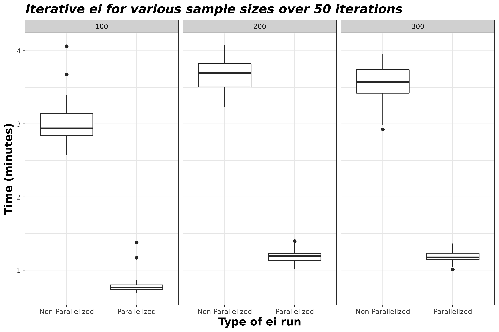

This vignette aims to highlight the parallel processing capabilities
within eiCompare. Functions that include this option are:

  - `ei_iter()`

  - `ei_rxc()` (only for diagnostic)

  - \[INSERT GEOCODING FUNCTION NAME HERE\]

Prior to attempting to run these functions in parallel, it is advised
you check your computer or server for the following properites:

  - You should more than 4 physical cores

  - You should have at least 16 GB of RAM

## Introduction to parallel processing

Building off of exisiting parallel processing packages such as `foreach`
and `doSNOW`, this package includes parallel processing capabiltiies to
speed up ecological inference analyses.

*Parallel processing* decreases the time needed for your processes by
splitting the job amongst your computer’s CPU cores. We recommend 16 GB
of RAM so that R can store the data you are currently working on.
Furthermore, if you are using multiple cores, the minimum RAM needed is
the product of the number of cores you’re using and the size of your
data.So if you are working on 4 cores and your dataset is 1 GB, you’ll
be using at least 4 GB of RAM.

In order to make this functionality more accessible to users,
eiCompare’s functions that include parallel processing include a check
for the number of cores you have available to you. If you have less than
4 cores, our functions will not let you proceed with parallelization.
Even with exacltly 4 cores, the functions will return a warning that
parallelization is not recommended.

There are many sources online if you’d like to learn more about
parallelization in general.

## Walking through an example: `ei_iter()`

In this vignette, we’ll be focusing on `ei_iter()`, which is discussed
in a previous vignette, \[INSERT TITLE HERE\]. We recommend that you
review this vignette prior to attempting parallelization for this
function.

The data we’ll be using for this example is from 2014 elections in
California, specifically looking at voting results and racial
demogrphiacs for Corona by precinct.

``` r
head(corona)
```

    #>   precinct totvote pct_husted pct_spiegel  pct_ruth pct_button pct_montanez
    #> 1    24000    1626 0.11070111   0.2091021 0.1795818  0.1537515    0.1599016
    #> 2    24003    1214 0.10790774   0.2257002 0.1746293  0.1548600    0.1746293
    #> 3    24005     732 0.11475410   0.2281421 0.1653005  0.1352459    0.1707650
    #> 4    24013    1057 0.08987701   0.2346263 0.1702933  0.1182592    0.2043519
    #> 5    24014    1270 0.13149606   0.2299213 0.1834646  0.1259843    0.1629921
    #> 6    24015     595 0.09411765   0.2621849 0.1579832  0.1478992    0.1663866
    #>     pct_fox  pct_hisp  pct_asian pct_white pct_non_lat
    #> 1 0.1869619 0.2483393 0.03730199 0.7143587   0.7516607
    #> 2 0.1622735 0.3296460 0.02359882 0.6467552   0.6703540
    #> 3 0.1857923 0.3604214 0.05944319 0.5801355   0.6395786
    #> 4 0.1825922 0.2364439 0.07377049 0.6897856   0.7635561
    #> 5 0.1661417 0.2751764 0.05516357 0.6696600   0.7248236
    #> 6 0.1714286 0.2959076 0.14165792 0.5624344   0.7040924

We have a row for every precinct, if we check the dimensions of our
dataset you will see that this is 46. We also have 12 variables included
in this dataset.

``` r
print(dim(corona))
```

    #> [1] 46 12

``` r
names(corona)
```

    #>  [1] "precinct"     "totvote"      "pct_husted"   "pct_spiegel"  "pct_ruth"    
    #>  [6] "pct_button"   "pct_montanez" "pct_fox"      "pct_hisp"     "pct_asian"   
    #> [11] "pct_white"    "pct_non_lat"

The variables are as follows: - `precinct`: Precinct ID number

  - `totvote`: Total number of votes cast

  - `pct_husted`: Percent of voting precinct population who voted for
    Husted

  - `pct_spiegel`: Percent of voting precinct population who voted for
    Spiegel

  - `pct_ruth`: Percent of voting precinct population who voted for Ruth

  - `pct_button`: Percent of voting precinct population who voted for
    Button

  - `pct_montanez`: Percent of voting precinct population who voted for
    Montanez

  - `pct_fox`: Percent of voting precinct population who voted for Fox

  - `pct_hisp`: Percent of voting precinct population who identify as
    Hispanic

  - `pct_asian`: Percent of voting precinct population who identify as
    Asian

  - `pct_white`: Percent of voting precinct population who identify as
    White

  - `pct_non_lat`: Percent of voting precinct population who identify as
    Non-Latino

Non-Latino encompasses the Asian and White voting population.

``` r
corona$pct_hisp + corona$pct_non_lat == 1
```

    #>  [1] TRUE TRUE TRUE TRUE TRUE TRUE TRUE TRUE TRUE TRUE TRUE TRUE TRUE TRUE TRUE
    #> [16] TRUE TRUE TRUE TRUE TRUE TRUE TRUE TRUE TRUE TRUE TRUE TRUE TRUE TRUE TRUE
    #> [31] TRUE TRUE TRUE TRUE TRUE TRUE TRUE TRUE TRUE TRUE TRUE TRUE TRUE TRUE TRUE
    #> [46] TRUE

So for this analysis there are 5 candidates (Husted, Spiegel, Ruth,
Button, and Montanez) and 3 racial groups (Hispanic/Latino, Asian, and
White). With that, let’s set up the inputs we need for the function and
time it to see how long it takes to complete the iterative ei analysis
without parallelization.

``` r
cand_cols <- c("pct_husted", "pct_spiegel", "pct_ruth", "pct_button", "pct_montanez", "pct_fox")
race_cols <- c("pct_hisp", "pct_asian", "pct_white", "pct_non_lat")
totals_col <- "totvote"

# Run without parallization
start_time <- Sys.time()
results_test <- ei_iter(corona, cand_cols, race_cols, totals_col)
```

    #>   |                                                                              |                                                                      |   0%  |                                                                              |======                                                                |   8%

``` r
(end_time <- Sys.time() - start_time)
```

    #> Time difference of 1.893189 mins

To run in this parallel, all you need to do is toggle `par_compute` to
be TRUE.

``` r
# Run with paralleization
start_time <- Sys.time()
results_test <- ei_iter(corona, cand_cols, race_cols, totals_col, par_compute = TRUE)
```

    #>   |                                                                              |                                                                      |   0%  |                                                                              |===                                                                   |   4%  |                                                                              |======                                                                |   8%  |                                                                              |=========                                                             |  12%  |                                                                              |============                                                          |  17%  |                                                                              |===============                                                       |  21%  |                                                                              |==================                                                    |  25%  |                                                                              |====================                                                  |  29%  |                                                                              |=======================                                               |  33%  |                                                                              |==========================                                            |  38%  |                                                                              |=============================                                         |  42%  |                                                                              |================================                                      |  46%  |                                                                              |===================================                                   |  50%  |                                                                              |======================================                                |  54%  |                                                                              |=========================================                             |  58%  |                                                                              |============================================                          |  62%  |                                                                              |===============================================                       |  67%  |                                                                              |==================================================                    |  71%  |                                                                              |====================================================                  |  75%  |                                                                              |=======================================================               |  79%  |                                                                              |==========================================================            |  83%  |                                                                              |=============================================================         |  88%  |                                                                              |================================================================      |  92%  |                                                                              |===================================================================   |  96%  |                                                                              |======================================================================| 100%

``` r
(end_time <- Sys.time() - start_time)
```

    #> Time difference of 1.212652 mins

This saves us a about a minute for this specific data set. With larger
datasets and more candidate and racial demographic comparisons, the
process will take longer and parallelization will become more
beneficial.

## Expectations for parallelization

Depending on your dataset, the number of races and candidates you’re
analyzung, the amount of RAM you have, and the number of physical and
logical cores you have the amount of time it takes to run eiCompare
functions will differ. Furthermore, its important to uderstand
parallelizing requires overhead time and relationships between sample
size and run time are not necessarily linear. In the plot below, you’ll
be able to see the average run time of a dataset for a sample of 100,
200, and 300 precincts. It is apparent here that less samples does not
equate a shorter run time. Nonetheless, parallelization can save
multitudes of the \~4 minutes saved here, especially if you repeat
function calls for analyses such as a boostrap.


<!-- -->

