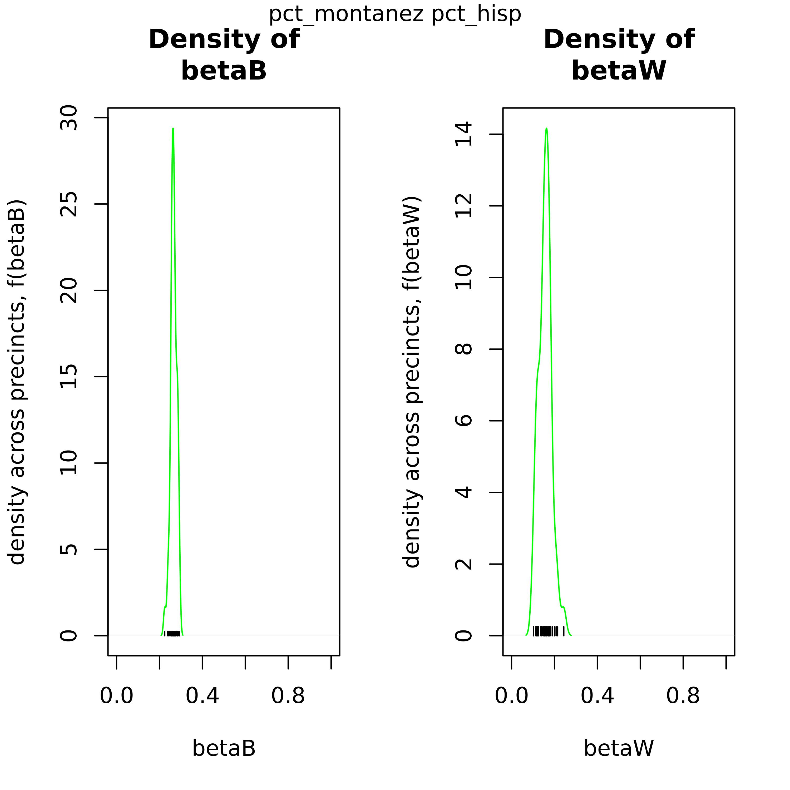
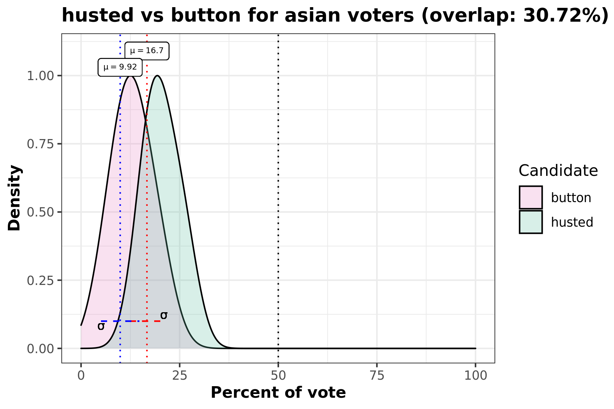
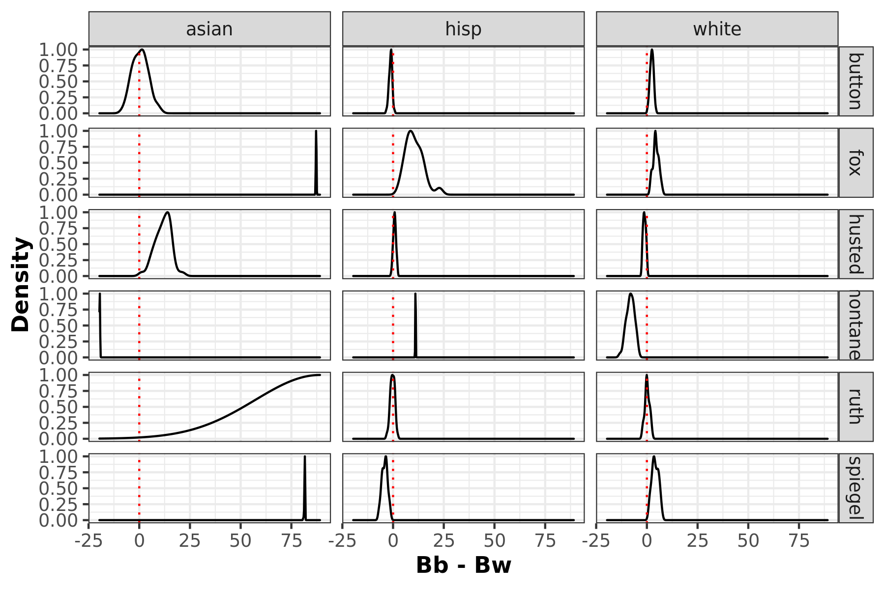

This vignette aims to highlight the functionalities within eiCompare to
produce plots. These visualizations include:

  - *Tomography plots*
    
    Each line on the graph represents &beta;<sub>b</sub> and &beta;<sub>w</sub> each
    geographical unit (i.e. precinct). Not only does this plot
    graphically show the bounds those values have, the overlayed
    contours show which values on those lines have the highest
    probability of being an accurate estimate.

  - *Density &beta;<sub>b</sub> and &beta;<sub>w</sub> comparison plots*
    
    As an output from iterative ei, these 2-pane plots compare the
    distribution of &beta;<sub>b</sub> and &beta;<sub>w</sub> to show the uncertainty
    of the point estimates.

  - *Density voter choice comparison plots for each race*
    
    This density plot comparison answers the question “How did Candidate
    A and Candidate B’s votes for race C compare?”. This visualization
    includes information such as standard deviation, avergae percentage
    of race C voters, and overlap percentage.

  - *MCMC convergence density plots*
    
    These MCMC draw plots show… {NOT COMPLETE}

  - *Summary plot to compare iterative ei and RxC results*
    
    As discussed in Barreto, Collingwood, Garcia-Ross, and Oskooii’s
    study, RxC and iterative EI should produce similar results. This
    output visualizes the difference seen in these two methods.

These plots can be created as part of running iterative ei, `ei_iter()`,
as we as `ei_rxc()`. Furthermore, this notebook will cover how to use
these plot outputs and use the `patchwork` package to create
consolidated figures for reports and presentations.

## Introducing our example data set: Corona, CA

The data we’ll be using for this example is from 2014 elections in
California, specifically looking at voting results and racial
demogrphiacs for Corona by precinct.

``` r
head(corona)
```

    #>   precinct totvote pct_husted pct_spiegel  pct_ruth pct_button pct_montanez
    #> 1    24000    1626 0.11070111   0.2091021 0.1795818  0.1537515    0.1599016
    #> 2    24003    1214 0.10790774   0.2257002 0.1746293  0.1548600    0.1746293
    #> 3    24005     732 0.11475410   0.2281421 0.1653005  0.1352459    0.1707650
    #> 4    24013    1057 0.08987701   0.2346263 0.1702933  0.1182592    0.2043519
    #> 5    24014    1270 0.13149606   0.2299213 0.1834646  0.1259843    0.1629921
    #> 6    24015     595 0.09411765   0.2621849 0.1579832  0.1478992    0.1663866
    #>     pct_fox  pct_hisp  pct_asian pct_white pct_non_lat
    #> 1 0.1869619 0.2483393 0.03730199 0.7143587   0.7516607
    #> 2 0.1622735 0.3296460 0.02359882 0.6467552   0.6703540
    #> 3 0.1857923 0.3604214 0.05944319 0.5801355   0.6395786
    #> 4 0.1825922 0.2364439 0.07377049 0.6897856   0.7635561
    #> 5 0.1661417 0.2751764 0.05516357 0.6696600   0.7248236
    #> 6 0.1714286 0.2959076 0.14165792 0.5624344   0.7040924

We have a row for every precinct, if we check the dimensions of our
dataset you will see that this is 46. We also have 12 variables included
in this dataset.

``` r
print(dim(corona))
```

    #> [1] 46 12

``` r
names(corona)
```

    #>  [1] "precinct"     "totvote"      "pct_husted"   "pct_spiegel"  "pct_ruth"    
    #>  [6] "pct_button"   "pct_montanez" "pct_fox"      "pct_hisp"     "pct_asian"   
    #> [11] "pct_white"    "pct_non_lat"

The variables are as follows: - `precinct`: Precinct ID number

  - `totvote`: Total number of votes cast

  - `pct_husted`: Percent of voting precinct population who voted for
    Husted

  - `pct_spiegel`: Percent of voting precinct population who voted for
    Spiegel

  - `pct_ruth`: Percent of voting precinct population who voted for Ruth

  - `pct_button`: Percent of voting precinct population who voted for
    Button

  - `pct_montanez`: Percent of voting precinct population who voted for
    Montanez

  - `pct_fox`: Percent of voting precinct population who voted for Fox

  - `pct_hisp`: Percent of voting precinct population who identify as
    Hispanic

  - `pct_asian`: Percent of voting precinct population who identify as
    Asian

  - `pct_white`: Percent of voting precinct population who identify as
    White

  - `pct_non_lat`: Percent of voting precinct population who identify as
    Non-Latino

Non-Latino encompasses the Asian and White voting population.

``` r
corona$pct_hisp + corona$pct_non_lat == 1
```

    #>  [1] TRUE TRUE TRUE TRUE TRUE TRUE TRUE TRUE TRUE TRUE TRUE TRUE TRUE TRUE TRUE
    #> [16] TRUE TRUE TRUE TRUE TRUE TRUE TRUE TRUE TRUE TRUE TRUE TRUE TRUE TRUE TRUE
    #> [31] TRUE TRUE TRUE TRUE TRUE TRUE TRUE TRUE TRUE TRUE TRUE TRUE TRUE TRUE TRUE
    #> [46] TRUE

So for this analysis there are 5 candidates (Husted, Spiegel, Ruth,
Button, and Montanez) and 3 racial groups (Hispanic/Latino, Asian, and
White).

## `ei_iter()`: Tomography, Density comparison, Density voter choice

With that, let’s run ei\_ter to output the first set of visuals. If you
want to to opt to create plots for `ei_iter` you’ll need to set `plots`
to `TRUE`.

In addition, if you’d like to specificy where you would like to save
your plots, you can specify a `plots_path`. In this example we’ll just
set it to where this vignette lives.

``` r
save_path <- "~/eiCompare/output/"
```

Time to run our iteraative ei\!

``` r
cand_cols <- c("pct_husted", "pct_spiegel", "pct_ruth", "pct_button", "pct_montanez", "pct_fox")
race_cols <- c("pct_hisp", "pct_asian", "pct_white", "pct_non_lat")
totals_col <- "totvote"

# Run with plots =
ei_results <- ei_iter(corona, cand_cols, race_cols, totals_col,
  plots = TRUE, plot_path = save_path
)
```

    #>   |                                                                              |                                                                      |   0%

    #>   |                                                                              |======                                                                |   8%

    #> 
    #> [1] "Creating density plots"
    #>   |                                                                              |                                                                      |   0%

    #> Loading required package: ggplot2

    #> Loading required package: testthat

    #>   |                                                                              |==================                                                    |  25%

    #>   |                                                                              |===================================                                   |  50%

    #>   |                                                                              |====================================================                  |  75%

    #>   |                                                                              |======================================================================| 100%

Now that’s completed, we’ll walk through each plot type that is
generated from `ei_iter`.

### Tomography

Let’s look at the tomography plot for the Candidate for the Hispanic
demographic. Each line on this graph represents a precinct, showing the
posterior values for &beta;<sub>b</sub> and &beta;<sub>w</sub>. One of the key
features here is that this informs the bounds for these values for each
precinct. The red dots indicate their point estimates.

<!-- -->

### Density &beta;<sub>b</sub> and &beta;<sub>w</sub> comparison plots

These plots can be used to confirm this point estimate distributions for
&beta;<sub>b</sub> and &beta;<sub>w</sub> across precints. The green density curve
allows for insight into the location of this point estimate as well as
assess the associated uncertainty. Black tick marks at the bottom
indicate the locations of each point estimate that was calculated.

<!-- -->

### Density voter choice comparison plots for each race

This overlaid density plot answers the question “How do voters from a
certain racial demographic vote for two candidates across all
precincts?” In this particular example we’re looking at the Hispanic
population and comparing how they voted for Husted and Button in this
election. We can see that there is almost 30% of overlap between the
density curves for these two candidates.

<!-- -->

### Racial polarized voting density plots

Racially polarized voting by taking the difference of the posterior
distribution of the district level aggregates of &beta;<sub>b</sub> 
and &beta;<sub>w</sub>. The furthere the distribtuion mean is away from 0, the
higher possibility of RPV.

<!-- -->

#### BELOW NOT COMPLETE YET

## `ei_rxc()`: Density voter choice, MCMC convergence

### MCMC convergence density plots

## EI and RxC comparison chart

## Patchwork
